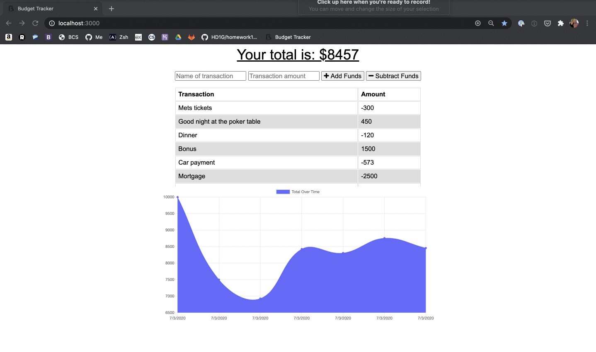

# Watch Your Spending
This budget tracking application keeps tabs on your expenses whether online or offline. 

## Table of Contents
1. [Description](#description)
2. [Installation](#installation)
3. [Contributing](#contributing)
4. [License](#license)



## Description
When traveling, access to cellular data and WiFi can be hit or miss. Users who want to track expenses at all times need offline access to their budgeting application for those times when connecting to the Internet fail. 

When users are online, they can log their expenses into MongoDB. Those expenses will stay with them offline, where they can add more expenses and deposits through IndexedDB.

Once users re-establish a network connection, the information from IndexedDB will transfer into MongoDB. 

The application can be started with this command:

```sh
npm start
```

The user will be told what port the app is running on and can go to `localhost:` in the web browser.

## Installation

Run `npm install` to include all necessary dependencies. 

## Contributing

Contributions and improvements to the project are welcome at any time. 

### License
[](https://opensource.org/licenses/MIT)